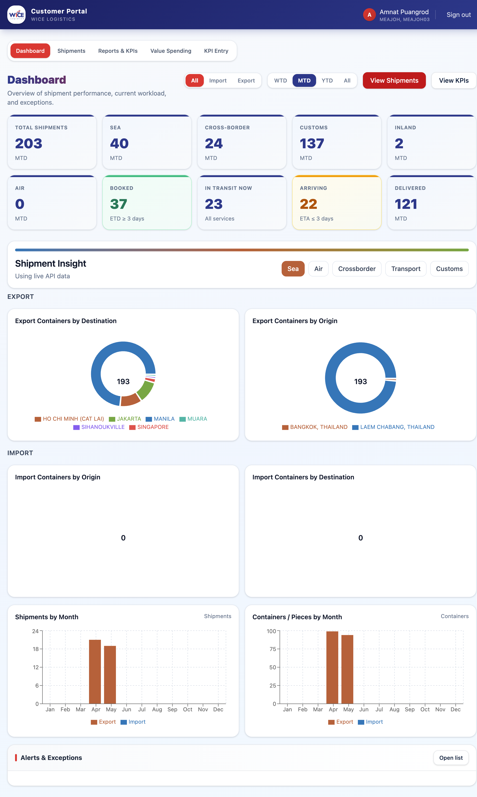
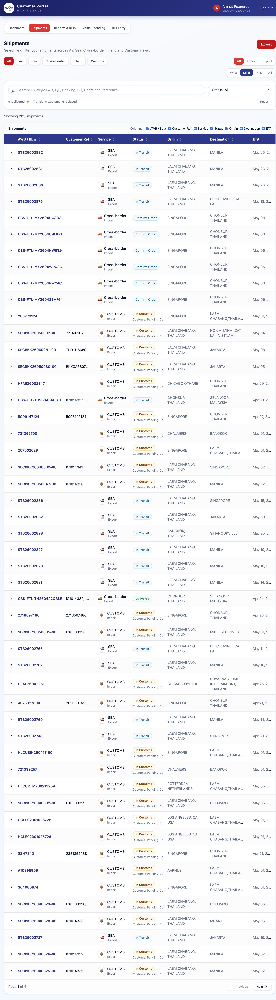
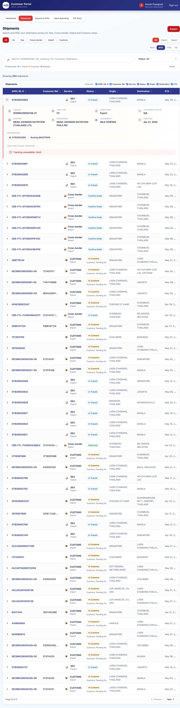
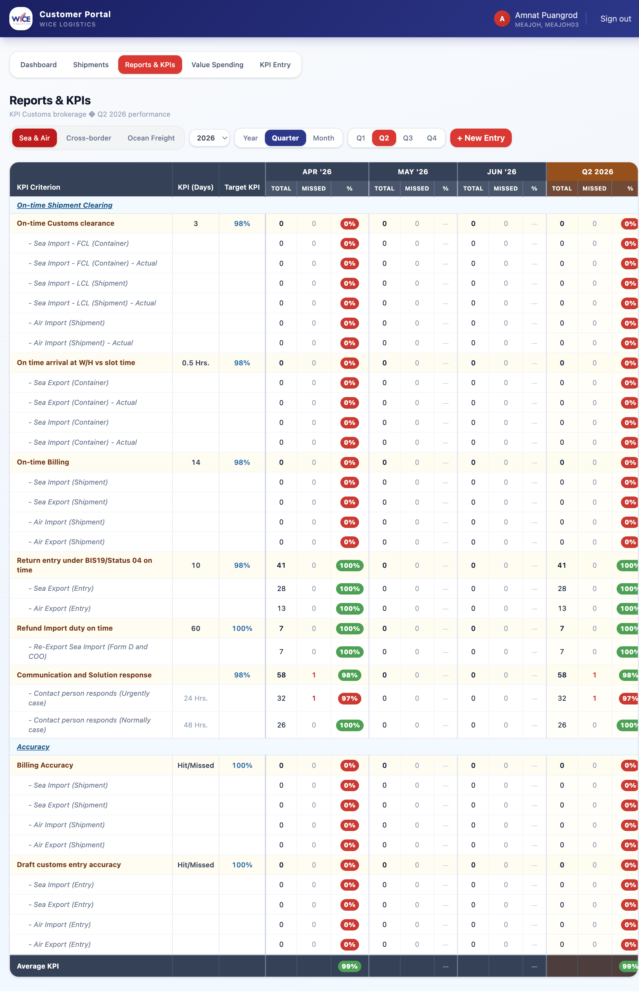
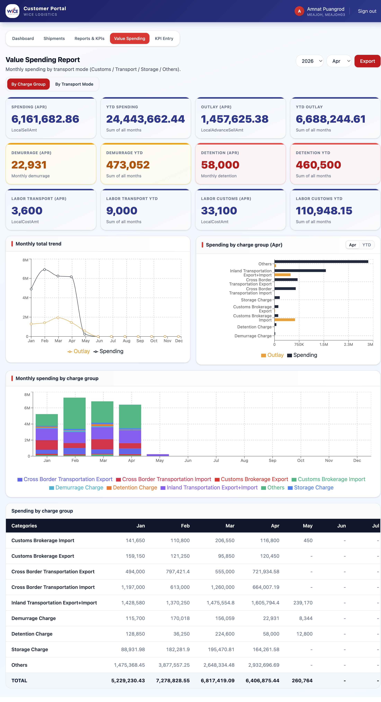

# WICE Customer Portal — User Guide

This guide walks you through the main areas of the Customer Portal:
**Dashboard**, **Shipments** (with shipment tracking), **Reports & KPIs**,
and **Value Spending**.

---

## Signing in

1. Open the portal URL provided by your account manager.
2. Click **Sign in with Microsoft** and complete login with your WICE
   Microsoft account.
3. After login, you'll land on the **Dashboard** by default.

The top bar always shows the signed-in user, the linked customer code,
and a **Sign out** button. The horizontal nav exposes the main sections:
Dashboard · Shipments · Reports & KPIs · Value Spending · KPI Entry.

---

## 1. Dashboard

The Dashboard provides a high-level overview of your shipping activity:

- **Summary cards** at the top show key counts and totals for the current
  period.
- **Charts** below the cards visualize monthly volumes and breakdowns by
  service mode.
- Use the dashboard as a starting point; drill into specific areas via
  the top navigation.

---

## 2. Shipments

The Shipments page lets you search and filter shipments across all
service modes.

### Filter controls

- **Mode tabs:** *All / Air / Sea / Cross-border / Inland / Customs*
- **Direction tabs:** *All / Import / Export*
- **Period:** *WTD / MTD / YTD / All*
- **Search box:** find by HAWB/MAWB, B/L, Booking #, PO, Container, or
  Reference.
- **Status dropdown:** *All / In Transit / In Customs / Delayed /
  Delivered*.
- **Status pills** (Delivered / In Transit / Customs / Delayed) give a
  quick count for the current filter set.
- **Reset** clears all filters.

### Table

- Columns can be toggled via the **Columns:** checkboxes (AWB/BL #,
  Customer Ref, Service, Status, Origin, Destination, ETA).
- Click any column header to sort.
- Use **Export** (top right) to download the filtered list.

### Tracking a shipment

Click the chevron at the start of a row to expand it and see the
shipment's tracking timeline.

The expanded panel shows milestone events (booking, gate-in, vessel
departure, arrival, customs clearance, delivery, etc.) with timestamps
and locations sourced from carrier and internal events.

---

## 3. Reports & KPIs

This page shows KPI performance for customs brokerage and related
services.

### Service tabs

Switch between **Sea & Air**, **Cross-border**, and **Ocean Freight** to
see the relevant KPI set for each business line.

### Period controls

- **Year selector:** pick the reporting year.
- **View mode:** *Year / Quarter / Month*.
- **Quarter buttons** (Q1–Q4) appear when *Quarter* is selected. The
  table always renders the **three months of the chosen quarter** (e.g.,
  Q2 → Apr / May / Jun) plus a quarter total column.
- **Month dropdown** appears when *Month* is selected.

### KPI table

Each row is a KPI criterion with:

- **KPI (Days)** — the SLA target in days/hours.
- **Target KPI** — the target percentage.
- For each period column: **TOTAL**, **MISSED**, and **%** achieved.
  - Green pill = on/above target
  - Red pill = below target
- The **Average KPI** row at the bottom summarizes overall performance
  for the selected period.

### Adding entries

Click **+ New Entry** (top right) to record a new KPI entry. KPI Entry
is also accessible from the main nav for staff users.

---

## 4. Value Spending

The Value Spending Report shows monthly spending by transport mode and
charge group.

### Top filters

- **Year** and **Month** selectors (top right) drive the "selected
  month" KPI cards and the bar chart highlight.
- **By Charge Group / By Transport Mode** toggle changes the table and
  chart breakdown axis.

### KPI cards

Three rows of summary cards:

1. **Spending / YTD Spending / Outlay / YTD Outlay** for the selected
   month, sourced from `LocalSellAmt` and `LocalAdvanceSellAmt`.
2. **Demurrage** and **Detention** — monthly and YTD totals, highlighted
   in warning/danger tones.
3. **Labor Transport** and **Labor Customs** — monthly and YTD costs
   (`LocalCostAmt`).

### Charts

- **Monthly total trend** — line chart of Spending vs. Outlay across the
  year.
- **Spending by charge group** — horizontal bar chart, with an
  *Apr / YTD* toggle to switch between selected-month and year-to-date
  totals.
- **Monthly spending by charge group** — stacked bar chart showing the
  composition of each month.

### Detail table

The bottom table lists every charge group across all 12 months with a
**TOTAL** row.

The Demurrage, Detention, and Storage rows are sourced from dedicated
text-match queries (`%DEMURRAGE%`, `%DETENTION%`, `%STORAGE%` against
item/account descriptions) so they reflect the full underlying figures
even when the item isn't classified into a category.

### Export

Use the **Export** button (top right) to download the report as a file.

---

## Tips

- All currency figures are in the local currency of each transaction
  (already converted at posting time).
- Period selectors are remembered while you navigate within a single
  session but reset when you sign out.
- If a page shows "Loading…" for an extended time, check the BFF/API
  logs — most pages depend on `/api/value-spending`, `/api/kpi`,
  `/api/shipments`, and `/api/dashboard`.
